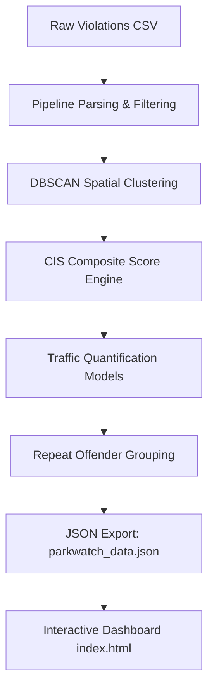
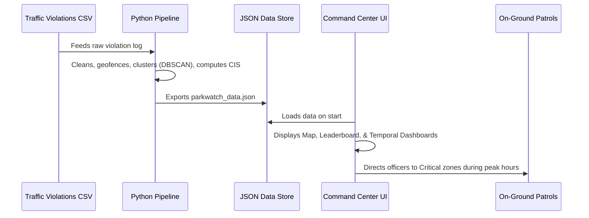

# Detailed Solution Report: ParkWatch AI

This report details how **ParkWatch AI** addresses the operational challenges of **Poor Visibility on Parking-Induced Congestion** and shifts enforcement from reactive patrolling to proactive, data-driven prioritization.

---

## 1. Operational Challenge vs. ParkWatch AI Solution

The table below outlines how our project resolves the three core operational challenges:

| Challenge | Why It's Hard Today | ParkWatch AI Solution |
| :--- | :--- | :--- |
| **Reactive Patrolling** | Enforcement is patrol-based and reactive, relying on officers driving around randomly. | **Proactive Enforcement Planning**: Identifies static, persistent violation clusters, allowing commanders to deploy enforcement squads to high-impact areas *before* peak congestion times. |
| **Quantifying Congestion** | No heatmap of parking violations vs. congestion impact. Difficult to know which parked vehicle blocks more traffic. | **Traffic Quantification Models & Heatmaps**: Integrates vehicle weights (PCU) and junction proximity to calculate real-world Capacity Loss and Delay Multipliers, overlaid on interactive Leaflet maps and temporal grids. |
| **Zone Prioritization** | Difficult to prioritize enforcement zones due to lack of metrics. | **Congestion Impact Score (CIS)**: A composite, weighted index (0-100) that ranks hotspots by their overall traffic footprint, highlighting "Critical" zones requiring immediate action. |

---

## 2. Core Technical Architecture & Methodology

The solution runs on a multi-stage Python data pipeline (`pipeline.py`) feeding a high-fidelity, interactive single-page web dashboard (`index.html`).

### A. Spatial Hotspot Detection (DBSCAN Clustering)
Instead of arbitrary grid lines, ParkWatch AI uses **DBSCAN (Density-Based Spatial Clustering of Applications with Noise)**:
* **Metric**: Haversine distance in radians to accurately compute distances on Earth's surface.
* **Epsilon ($\epsilon$)**: **150 meters** (the typical physical span of a parking-induced congestion bubble and walkable enforcement zone).
* **MinPts**: **8 violations** to filter out transient, isolated parking incidents and lock onto statistically significant hotspots.

### B. Congestion Impact Score (CIS) Formulation
To prioritize hotspots, we compute a composite **CIS (0 - 100)** for each cluster using five weighted sub-scores:

$$\text{Raw CIS} = 0.30 \cdot S_{\text{density}} + 0.25 \cdot S_{\text{junction}} + 0.15 \cdot S_{\text{vehicle}} + 0.20 \cdot S_{\text{persistence}} + 0.10 \cdot S_{\text{peak}}$$

1. **Spatial Density ($S_{\text{density}}$, 30%)**: Logarithmic scaling of violations per $\text{km}^2$ inside the cluster's radius.
2. **Junction Proximity ($S_{\text{junction}}$, 25%)**: Ratio of violations occurring at or near an intersection (where parked vehicles block turning lanes and cause gridlock).
3. **Vehicle Congestion Weight ($S_{\text{vehicle}}$, 15%)**: Weighted average representing physical road footprint (e.g., Bus/Truck = 3.0, LMV = 1.5, Two-Wheeler = 0.6).
4. **Temporal Persistence ($S_{\text{persistence}}$, 20%)**: Ratio of active days to total date range (identifies chronic, long-term hotspots).
5. **Peak Hour Overlap ($S_{\text{peak}}$, 10%)**: Fraction of offenses occurring during peak commute hours (07:00–10:00 and 16:00–20:00).

Clusters are tiered into **Critical** (CIS $\ge 70$), **High** ($45 \le \text{CIS} < 70$), **Medium** ($25 \le \text{CIS} < 45$), and **Low** (CIS $< 25$).

### C. Real-World Traffic Quantification Models
To move from abstract scores to physical metrics, the project translates clusters into four traffic engineering models:
* **Passenger Car Unit (PCU) Blockage Load**: Sum of all vehicle weights in a cluster, measuring total physical space blocked.
* **Lane Capacity Reduction (LCR%)**: Estimates the percentage reduction in traffic throughput capacity:
  $$\text{LCR} = \min(15.0 + 35.0 \cdot \frac{\text{Avg PCU}}{3.0} + 30.0 \cdot \text{Near Junction}, 85.0)$$
* **BPR Travel Time Delay Multiplier**: Models the exponential travel time increase for vehicles passing through the hotspot using the Bureau of Public Roads (BPR) delay formula:
  $$\text{Delay Multiplier} = 1.0 + 0.15 \cdot \left(\frac{1.0}{1.0 - \frac{\text{LCR}}{100}}\right)^2$$
* **Daily PCU Blockage Load (PCU-Hours / Day)**:
  $$\text{Daily Load} = \frac{\text{Total PCU Blockage}}{\text{Active Days}} \cdot (0.5 + 1.5 \cdot \text{Peak Hour Fraction})$$

---

## 3. Interactive Command Center Dashboard

The frontend interface (`index.html`) transforms these analytical outputs into actionable intelligence:

1. **Strategic Map Overlay**:
   * Displays hotspots styled dynamically by severity (Critical = glowing red, High = orange, Medium = yellow, Low = blue).
   * Toggles to a macro **Density Heatmap** to show citywide saturation vs. micro-enforcement zones.
2. **Prioritized Hotspot Leaderboard**:
   * Lists all hotspots ranked by CIS. Clicking a card auto-pans and zooms the map to its exact location.
3. **Granular Cluster Dashboards (Recently Enhanced)**:
   * Displays the 5 sub-score metrics via interactive progress bars.
   * Quantifies the physical capacity loss (e.g., `-62% lane capacity`) and delay index (`1.8x travel time delay`).
   * **Individual Cluster Temporal Dashboard**: Custom-renders local **Hourly Trend (Diurnal Cycle)** and **Weekly Trend (Day-of-Week Bar Chart)** charts for the selected cluster, showing exactly *when* the congestion peaks so patrol routes can be synchronized.
4. **Repeat Offender Tracking**:
   * Flagged list of vehicles with $\ge 3$ violations inside identical hotspots, helping identify commercial delivery vehicles or private owners repeatedly ignoring signs.

---

## 4. How It Works In Practice (Operational Flow)

1. **Data Load**: The traffic department dumps spatial violations logs into `dataset.csv`.
2. **Analysis Execution**: Running `pipeline.py` clusters the records, identifies repeat offenders, and computes congestion metrics.
3. **Resource Deployment**: The enforcement commander opens `index.html`. They filter by their police station, select the top ranked "Critical" zone, check its temporal charts to see that violations peak on Wednesdays at 11:00 AM, and dispatch an officer to that location at 10:45 AM.
